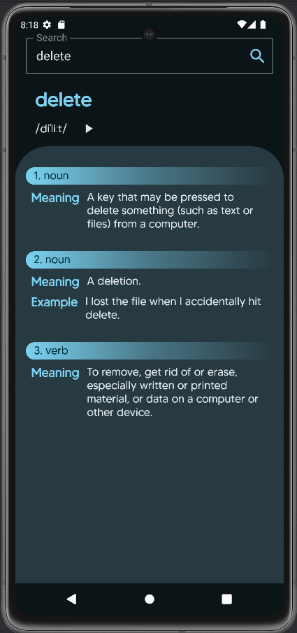
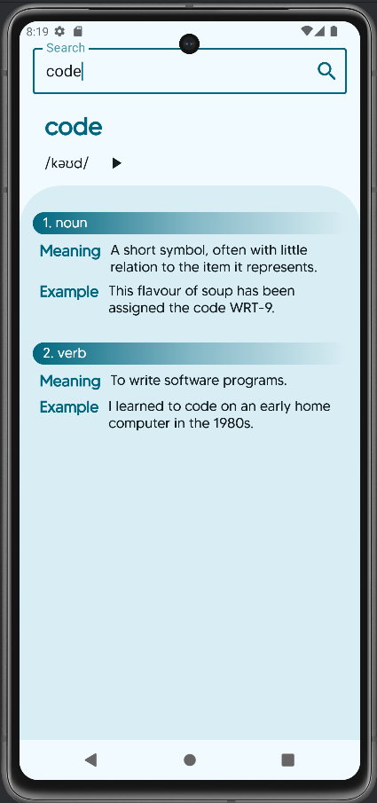

# Dictionary App

## Description

The Dictionary App is an Android application developed using Jetpack Compose and Kotlin. It allows users to search for words, view their meanings and part of speech with examples and also hear the phonetic pronunciation of the words. The app features a beautiful design for both dark and light themes, and includes a splash screen. This app utilizes modern Android development techniques, including Hilt for dependency injection and a clean architecture approach.

## Features

- **Word Search:** Search for words and get their meanings, phonetics, and part of speech with examples.
- **Phonetic Pronunciation**: Users can listen to the phonetic pronunciation of words by clicking on the audio icon.
- **Beautiful Design:** The app is designed with both dark and light themes for a visually appealing experience.
- **Splash Screen:** The app includes a splash screen for a smooth user experience.
- **MVVM Architecture:** Utilizes Model-View-ViewModel (MVVM) architecture for better code management and separation of concerns.
- **Dependency Injection:** Uses Dagger Hilt for dependency injection to manage app dependencies.
- **Network Requests:** Uses Retrofit to handle network requests to the dictionary API.

## Screenshots

## Technologies Used

- **Kotlin**
- **Jetpack Compose**
- **Dictionary API**
- **Retrofit**
- **Dagger Hilt**
- **MVVM Architecture**

## Installation

1. Clone the repository:
2. Open the project in Android Studio.
3. Build and run the app on an emulator or a physical device.

## Usage

- **Search for a word**: Enter a word in the search bar at the top and click the search icon.
- **View the word details**: The app will display the word's meanings and phonetic pronunciation.
- **Listen to the pronunciation**: Click on the audio icon next to the phonetic text to hear the pronunciation.

## Code Structure

- **presentation**: Contains the UI components and the main activity of the app.
- **domain**: Contains the data models and business logic.
- **ui.theme**: Contains the app's theme and style definitions.

## Dependencies

- **Jetpack Compose**: For building the UI.
- **Hilt**: For dependency injection.
- **Accompanist**: For system UI controller.

## Contributing

Contributions are welcome! If you have any suggestions, bug fixes, or feature implementations, please submit a pull request.

